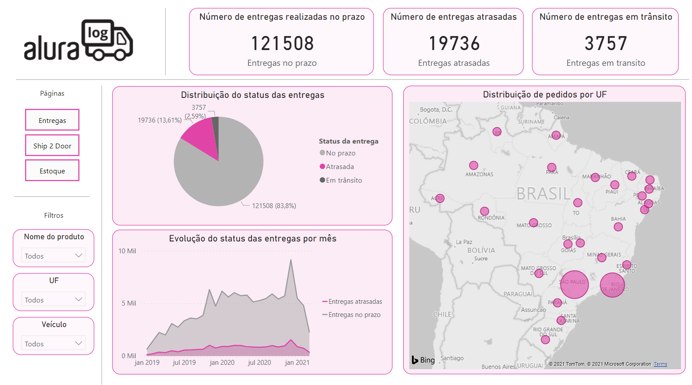
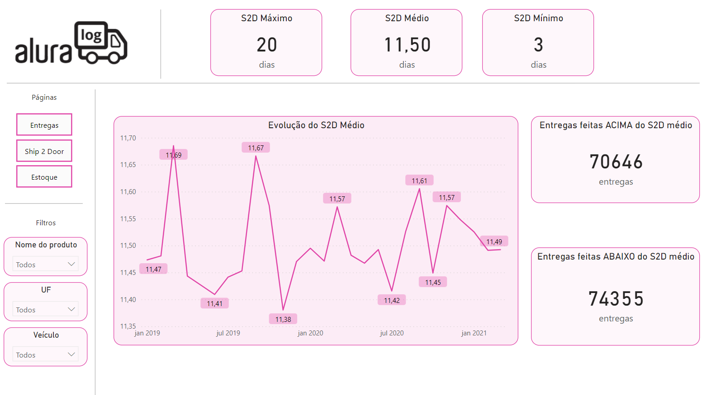
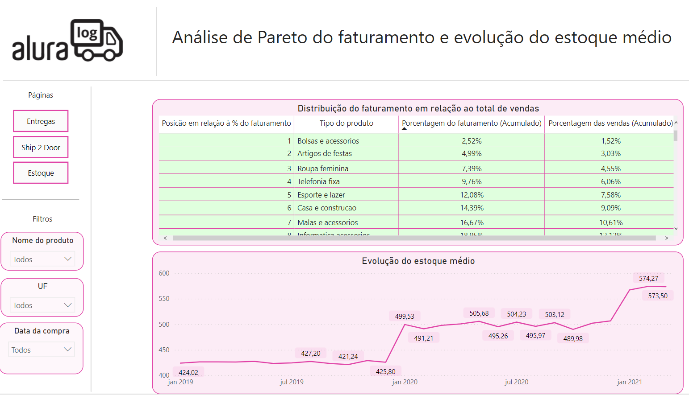

# Desafio BI Alura - Semana 1

O Dashboard pode ser acessado através [deste link](https://app.powerbi.com/view?r=eyJrIjoiYzVhMmVhY2QtMDllMS00YTYyLTg0YTEtY2FiNWM0NGJhZDYzIiwidCI6ImFmOTdjMzM5LTE3ODMtNDIzZi1iZGNmLTQ5ODViZmMwOTQ3ZSJ9).
## Sobre o desafio

Três empresas nos contrataram para entender suas bases de dados e exibir informações relevantes com o objetivo de auxiliar suas tomadas de decisão.

**Conceitos e técnicas de BI** serão utilizados para desenvolver um dashboard para uma das empresas.

A primeira empresa, **Alura Log**, necessita analisar dados sobre a **logística** de entregas do seu negócio.

A segunda empresa, **Alura Shop**, precisa de um dashboard para monitorar a campanha de **marketing** durante um mês.

A terceira empresa, **Alura Store**, precisa entender como anda a sua área **financeira**, pensando em **hipóteses**.

## Introdução à Semana 1

A pessoa que gerencia a área de logística da Alura Log, está enfrentando algumas mudanças em sua área por conta do aumento da demanda dos serviços de logística no período da pandemia. Ela quer manter a qualidade de seu serviço, mas para isso precisa acompanhar constantemente as métricas do seu departamento para tomar as melhores decisões. Quando nos contou isso, analisamos que para auxiliar nesse desafio precisaremos fazer um dashboard para logística. Para isso, vamos visualizar algumas métricas muito importantes para a área.

## Parte 1 - Trabalhando com dados

O nosso cliente disponibilizou 4 bases de dados sobre logística no formato CSV sendo essas bases:

1. **tabela pedidos** - contém o registro de todos os pedidos feitos pelos clientes.
2. **tabela produtos** - contém os produtos cadastrados e seus valores.
3. **tabela veículos** - contém veículos registrados que fazem o transporte dos produtos
4. **tabela estoque** - contém o registro de estoque dos produtos por mês

O dados podem ser obtidos em [link](https://drive.google.com/drive/folders/1saKsmnW4FvOw_MRG363pNEYFbFpGw5hf?usp=sharing) ou na pasta `Dados brutos`.

### Tratamento dos dados

O tratamento inicial dos dados foi feito em Python e o ajuste fino para a produção do dashboard foi feito dentro do Power Query no Microsoft Power BI. Por tratamento inicial dos dados, temos a padronização dos cabeçalhos e formatação básica dos campos.

Os dados após tratamento inicial estão disponibilzados na pasta `Dados Tratados`.

Os scripts em Python utilizados para o tratamento inicial estão na pasta `Scrips de Tratamento` devidamente documentados.

## Parte 2 - Criação do Dashboard

O Dashboard foi criado utilizando o Microsoft Power BI. A criação de métricas e novas colunas foram feitas utilizando o Power Query dentro do própprio programa.

### Estrutura do dashboard

Para melhor apresentar os dados, o dashboard foi dividido em três páginas
- A primeira apresenta infomações sobre as entregas: Quantidade de entregas feitas no Prazo, Entregas Atrasadas e em trânsito; Apresenta a distribuição destas em relação ao total de entregas; Apresenta a evolução da quantidade de entregas no prazo e atrasadas ao longo do tempo;

- A segunda página apresenta informações sobre S2D (Ship 2 Door), uma métrica que avalia quantos dias um pedido dura, desde a realizaçao até a entrega. Mostra-se o S2D médio, máximo e mínimo assim como a quantidade de entregas que duraram mais ou menos que o S2D médio

- A terceira página mostra a evolução do estoque médio ao longo do tempo assim como a participação de cada categoria de produto no faturamento e no total de vendas.

